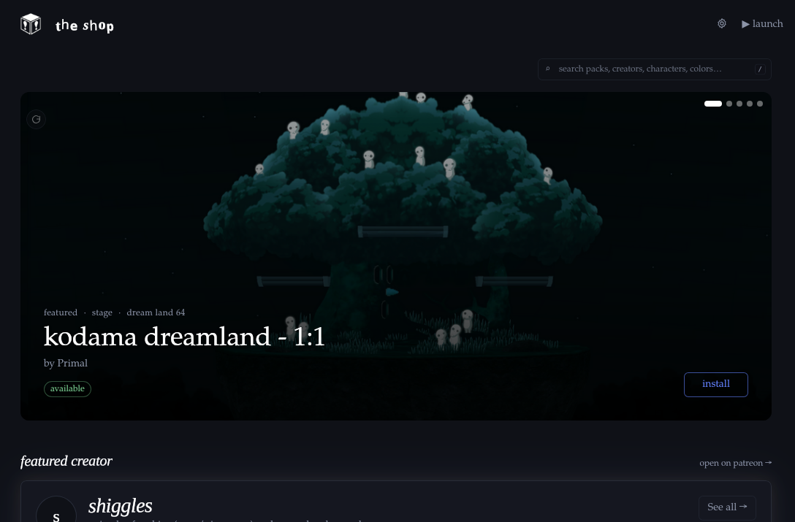

# the shop

A cross-platform desktop app for browsing and installing Super Smash Bros. Melee mods that creators publish on Patreon. Logs into your Patreon, surfaces what you have access to, and one-clicks the install into your Slippi setup.



## Why

Installing Melee skins by hand is half a dozen tools deep. Renaming `.dat` files by HAL conventions, rebuilding the ISO without corrupting it, validating that a skin won't desync online — none of that is the user's job. The shop does the file-format work invisibly and exposes a normal "browse, click install, hit launch" flow.

We don't run a server. Your Patreon session, your machine, your file. We're just a client.

## What you get

- **Browse a community-curated catalog.** ~1,250 entries from 13 creators today (Primal / Animelee, Mooshies, shiggles, Skraton, sinaa, xRunRiot, chiefneif, Lazlo, gonko, Dewrion, Gay Lord Erika, PigsSSBM, Animelee GFX). Character skins, stages, effects, UI overlays, items.
- **Connects with your existing Patreon login.** Reads your `session_id` cookie from your normal browser (Firefox / Chrome / Brave / Edge / Safari) — works for any login method including Google.
- **Honors your real entitlements.** Uses Patreon's per-post `current_user_can_view`, not just tier math, so a former-patron with through-end-of-period access sees everything they can actually install.
- **Slippi safety verdicts on every entry.** Skeleton-compare for character skins, collision-compare for stages. A red `may desync` pill or green `✓ slippi` pill on every card before you install.
- **One-click install for everything.** Character skins ride the ISO patcher; stages / effects / UI inject at their HAL filename; texture packs copy into Slippi's `Load/Textures/GALE01/`. Zip and 7z archives unpack to the right inner file automatically.
- **Stash before you cancel.** Per-creator "download N" button caches every skin you can currently view from that creator. Critical when a sub is about to lapse — files stay on disk, you can reinstall any of them later with no re-download and no Patreon required.
- **Local-first reinstall.** Anything you've installed before reinstalls instantly from your library. Cancelled your sub? You still have your skins.
- **One-click vanilla.** "Back to vanilla Melee" undoes every install and points Slippi back at your original ISO. Your downloaded files stay; reinstall is one click.

## Quick start

You'll need:
- A vanilla Melee NTSC v1.02 ISO (the shop never bundles or distributes Melee — bring your own copy, the same one Slippi already uses).
- [Slippi Launcher](https://slippi.gg/) installed and pointed at that ISO.
- A Patreon account (free works; you'll only see paid content for tiers you back).

### Run from source (current path)

Pre-built binaries aren't shipping yet — we're getting code-signing sorted. To run:

```sh
. ~/.cargo/env                          # Rust
. ~/.nvm/nvm.sh && nvm use --lts        # Node + pnpm
pnpm install
pnpm tauri dev
```

First launch shows a setup modal — confirms the auto-detected Slippi paths and asks for your vanilla ISO. Then click **Connect Patreon**; the app reads your existing browser session.

## Connection options

In order of UX quality:

1. **Auto-read from system browser** *(default)* — log into patreon.com normally in your usual browser, click Connect; we read the `session_id` cookie via [rookie](https://github.com/thewh1teagle/rookie). Works for any login method including Google.
2. **In-app webview login** *(advanced fallback)* — opens a Patreon login window inside the app. Works for email and Apple sign-in; **fails for Google** because Google blocks embedded webviews.

## Two pages

- **Storefront** — what's available. Filterable by kind / character / creator. Big preview cards with safety pills, format flavors (animelee vs. vanilla), tier-required pricing, and the install button. Click into any card for the per-slot drawer.
- **My stuff** — what's already on your machine. Two sections: *from patreon* and *locally imported*. Same card layout as the storefront so you don't lose visual context. A "stash from creators" list at the top lets you bulk-download every viewable skin from a creator before you cancel a sub.

## Texture index

The catalog lives in [`texture-index/index.json`](texture-index/index.json). The app fetches it from this repo's `main` branch on launch (5-minute TTL) with a compile-time bundled fallback if the network is down.

- See [`docs/texture-index.md`](docs/texture-index.md) for the schema reference and how to contribute entries.
- See [`docs/slippi-compatibility.md`](docs/slippi-compatibility.md) for the validator's verdict logic (skeleton check for costumes, collision check for stages).
- All install state is keyed by entry `id`; renaming an id orphans installed copies.
- Preview images come from Patreon's CDN as signed URLs and may eventually 404 — the card falls back to a quiet greyed shop-logo placeholder.

## Repo layout

```
src/                          React + Vite frontend
  routes/
    Connect.tsx               Patreon connect (browser-cookie + webview)
    Browse.tsx                storefront — featured carousel, search, drawer
    Account.tsx               cog menu (Library + Settings stacked)
    Library.tsx               "my stuff" — installed + manually imported
    Settings.tsx              ISO + Slippi paths, patreon account, reset
  components/
    SafeImage.tsx             preview-image loader with fallback
    NoPreview.tsx             greyed shop-logo placeholder (no-image state)
    BusyOverlay.tsx           full-screen install / reset spinner
    SearchBar.tsx             fuzzy-search packs / creators / characters
  lib/
    ipc.ts, types.ts          Tauri command bindings + shared types
    melee.ts                  HAL char / slot / stage codes -> display names
src-tauri/                    Rust backend
  src/
    patreon.rs                login, browser-cookie reader, memberships,
                              viewable_posts (per-post can-view gate),
                              429 retry-with-backoff
    skin_index.rs             GitHub fetch + cache + entitlement annotation,
                              per-creator viewable / stashed counts
    patreon_download.rs       post fetch -> CDN download -> install dispatcher;
                              local-cache install short-circuit;
                              per-creator bulk stash
    install.rs                install_pack (skins) + install_iso_asset (others)
    texture_pack.rs           folder-copy install for Dolphin texture packs
    zip_helper.rs             zip + 7z extract; magic-byte format dispatch
    paths.rs                  per-OS path resolution
    slippi_config.rs          read/write Slippi Launcher settings JSON
    reset.rs                  back-to-vanilla across all install tables
    launch.rs                 spawn Slippi Launcher
  resources/
    hsd-tool/                 vendored the-shop-hsd CLI
                              (skeleton + collision validator)
texture-index/
  index.json                  the canonical texture catalog
tools/
  build-index.py              Patreon scraper that writes texture-index/index.json
  hsd-tool/                   .NET source for the-shop-hsd (extends HSDLib)
docs/
  texture-index.md            schema reference + contribution flow
  slippi-compatibility.md     validator verdict logic
  preview-rendering.md        why we don't render in-app previews
  dolphin-preview.md          (future) Dolphin headless preview pipeline notes
  screenshots/                README image assets
```

## Local data

App data (SQLite DB, patched ISO, downloaded skins, extracted archives) lives at:

| OS      | Path                                              |
|---------|---------------------------------------------------|
| Linux   | `~/.local/share/the-shop/`                        |
| macOS   | `~/Library/Application Support/the-shop/`         |
| Windows | `%APPDATA%\the-shop\`                             |

Nothing is installed system-wide. "Back to vanilla" + uninstalling the app and removing this folder fully removes the shop from your machine.

## Status

- **v0.5 (current)** — Patreon-aggregator core with safety validation, per-creator stash flow, viewable-posts gating, local-cache reinstall, and a unified my-stuff library.
- **What's working well** — install / uninstall / reinstall round trip; cross-creator browsing; tier-price resolver via campaign rewards; 7z + zip archive extraction; ISO-mode install for character skins, stages, effects, UI, items, and texture packs.
- **Known caveats**
  - 51 character_skin entries (Marth, Roy, Mewtwo, Dr. Mario) install correctly via the Patreon path but break the local-import path due to slot-codes mapping mismatches. Audit pending.
  - 56 zip-bundled entries have *guessed* `inner_filename` — install surfaces a clear "not found inside archive" if the guess is wrong. PR a correction when that happens.
  - Per-skin preview images are post-level (one image per Patreon post, shared across all skins in that post).
  - RAR archives aren't supported yet — the unrar Rust ecosystem has license issues we're not vendoring today.

## Tests

```sh
cd src-tauri && cargo test
```

Unit tests cover the filename parser. End-to-end install / uninstall / reinstall / reset is a manual flow today.

## Contributing entries

Two paths:

1. **Index entry only** (no scrape): edit [`texture-index/index.json`](texture-index/index.json) directly, open a PR. The schema is in [`docs/texture-index.md`](docs/texture-index.md).
2. **Whole creator**: run `python3 tools/build-index.py <patreon-url-or-creator-id>` against your own session, audit the diff, and PR the result.

`build-index.py` ships with `--regroup-all`, `--revalidate-all`, and `--reprice-all` flags for migrating existing entries after schema or pricing-logic changes.

## License

Source code is MIT-licensed. The `texture-index/index.json` catalog is a list of pointers (Patreon post IDs + filenames) — no skin content is redistributed. Each creator retains rights to their work; the shop is a player-side client that authenticates as the patron and downloads what Patreon serves them.
